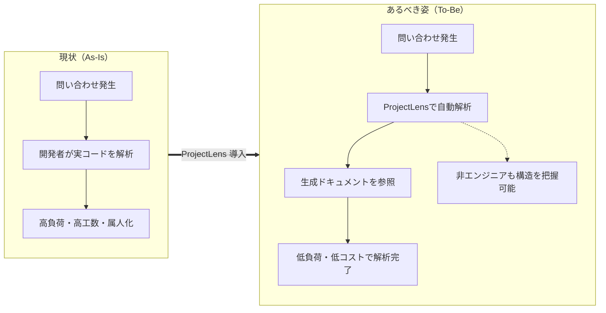
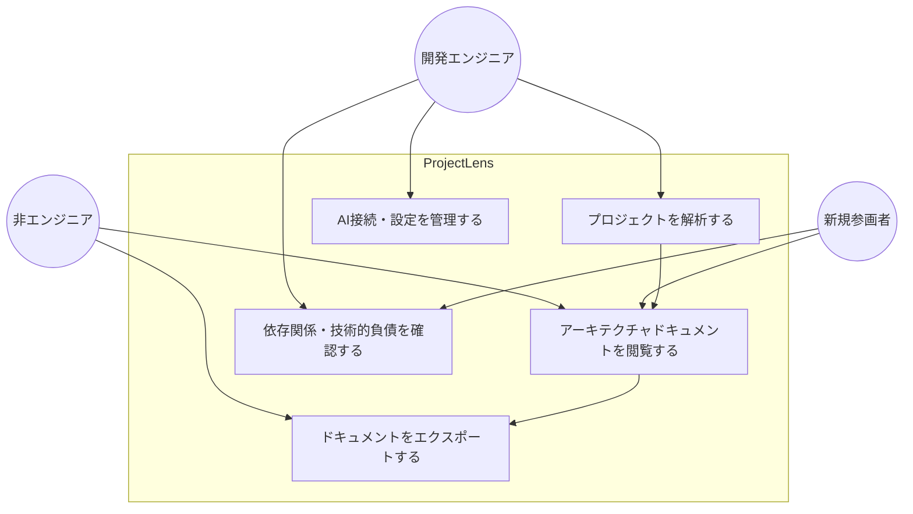

# ProjectLens 要件定義書

| 項目 | 内容 |
|---|---|
| ドキュメント名 | ProjectLens 要件定義書 |
| バージョン | 1.0.0 |
| 作成日 | 2026-08-05 |
| 対象読者 | 開発担当（Claude Code 含む）、プロダクトオーナー |
| 関連文書 | 02_仕様書.md / 03_設計書.md |

---

## 1. 背景・目的

### 1.1 背景（解決したい課題）

現在構築済みのシステムには、仕様書・設計書などのドキュメントが整備されていないものが多い。この状態では以下の問題が発生している。

- ユーザーから問い合わせがあった際、開発者は**実コードを直接読み解いて**システムの仕様や設計を解析する必要がある
- 解析作業により開発者の負荷が上がり、多くの工数（＝コスト）を必要とする
- システムの理解が特定の開発者に属人化し、保守性・引き継ぎ性が低下する

### 1.2 目的（目指す世界）

**「非エンジニアでもリバースエンジニアリングができる世界」** を実現する。

ProjectLens は、ソースコードプロジェクトを解析し、アーキテクチャドキュメントを自動生成することで、

1. 非エンジニアでもツールの操作だけでシステム構造を把握できるようにする
2. ツールのアウトプット（自動生成ドキュメント）を起点に、開発エンジニアが**低負荷・低コスト**でシステムを解析できるようにする
3. ドキュメント不在システムの「実コードを読むしかない」状況を根本から変える

### 1.3 プロダクトビジョン図

---

## 2. プロダクト概要

| 項目 | 内容 |
|---|---|
| プロダクト名 | ProjectLens |
| 種別 | デスクトップアプリケーション |
| 概要 | ソースコードプロジェクトを解析し、アーキテクチャドキュメントを自動生成する。静的解析とAI解析を組み合わせ、プロジェクトの構造・依存関係・技術的負債を可視化する |
| 技術スタック | Tauri（Rust バックエンド + Web フロントエンド） |
| AIプロバイダ | NewtonX（社内AI、Pythonサイドカー経由） |
| キャッシュ | SQLite |
| 生成ドキュメント | システム仕様書 / システム基本設計書 / 詳細設計書（ファイル・RPAコンポーネント単位）の3成果物（各 Markdown / HTML / JSON 形式で出力） |

---

## 3. 利用者（ペルソナ）と利用シナリオ

### 3.1 想定利用者

| ペルソナ | 役割 | 主な利用目的 |
|---|---|---|
| 開発エンジニア | システム保守・改修担当 | 問い合わせ対応時の仕様調査、改修影響範囲の把握、技術的負債の特定 |
| 非エンジニア（企画・サポート等） | 問い合わせ一次対応、企画 | システム構造の概要把握、開発者への的確なエスカレーション |
| 新規参画メンバー | オンボーディング中の開発者 | プロジェクト全体像の短期間でのキャッチアップ |

### 3.2 主要ユースケース

---

## 4. 機能要件

### 4.1 機能一覧

| ID | 機能名 | 概要 | 優先度 |
|---|---|---|---|
| FR-01 | プロジェクトスキャン | フォルダを走査し、対象ファイルを抽出・ハッシュ化する | 必須 |
| FR-02 | 静的解析 | メトリクス・依存関係・関数/クラス構造を抽出する | 必須 |
| FR-03 | AI解析（ファイル単位） | 各ファイルの役割・公開API・設計パターン・重要度・潜在的問題を解析する | 必須 |
| FR-04 | AI解析（プロジェクト全体） | アーキテクチャパターン・モジュール構成・技術スタック・データフロー・技術的負債を解析し、Mermaid図を生成する | 必須 |
| FR-05 | ドキュメント生成・エクスポート | 「システム仕様書」「システム基本設計書」「詳細設計書（ファイル/コンポーネント単位）」の3成果物を、それぞれ独立してMarkdown / HTML / JSON 形式で出力。Mermaid埋め込みに対応 | 必須 |
| FR-06 | キャッシュ管理 | 解析結果をSQLiteにキャッシュし、再解析コストを削減する | 必須 |
| FR-07 | 解析履歴管理 | トークン数・所要時間・ステータス等の履歴を保持・参照・削除する | 必須 |
| FR-08 | 設定管理 | scan / ai / cache / export / ui 設定の読込・保存・リセット | 必須 |
| FR-09 | APIキー管理 | OS資格情報ストア経由でAPIキーを安全に保存・取得・削除する | 必須 |
| FR-10 | 進捗表示・キャンセル | 解析進捗のリアルタイム表示と処理キャンセル | 必須 |
| FR-11 | AI接続テスト | 設定したAIプロバイダへの接続確認 | 必須 |
| FR-12 | RPA定義ファイル解析 | Power Platform / Power Automate for Desktop / UiPath の定義ファイルを検出・解析し、フロー構造をドキュメント化する | 必須 |

### 4.2 機能要件詳細

#### FR-01 プロジェクトスキャン
- ユーザーが選択したプロジェクトフォルダを再帰的に走査すること
- `.gitignore` を尊重し、追加の除外パターンを設定可能とすること
- ファイルサイズ上限・ファイル数上限を設定可能とすること
- 多言語対応：TypeScript/JavaScript, Rust, Python, Java, Go, C#, C/C++ 等
- 各ファイルに対し SHA-256 ハッシュを生成すること（キャッシュ判定用）

#### FR-02 静的解析
- コードメトリクス（行数・循環的複雑度・ネスト深度等）を算出すること
- import/export を解析し、関数・クラスを抽出すること
- 依存関係グラフを構築し、fan-in / fan-out の算出および循環依存の検出を行うこと

#### FR-12 RPA定義ファイル解析
- 以下3種のRPAツールの定義ファイルを検出・解析できること
  - **Power Platform**（Power Automate クラウドフロー / Power Apps）: ソリューションエクスポート（solution.xml、customizations.xml、Workflows/*.json 等）
  - **Power Automate for Desktop（PAD）**: Robinスクリプト形式のフローファイル（アクションのコピー&テキスト保存、またはソリューションエクスポート由来）
  - **UiPath**: プロジェクトファイル（project.json）およびワークフローファイル（*.xaml）
- 検出は拡張子ではなく構造パターン・内容マーカーで判定できること
- RPA定義ファイルからフロー名・トリガー・アクション・コネクタ/アクティビティ・参照先を構造解析できること
- AI解析によりフローの目的・処理内容・潜在的問題を日本語で要約し、フロー図（Mermaid）を生成できること
- 対応RPAツールは設定で拡張可能な構造とすること（上記3種以降のツールも実装追加のみで対応できること）

#### FR-03 / FR-04 AI解析
- ファイル単位：役割要約、公開API、設計パターン、重要度スコア（1-10）、潜在的問題を出力すること
- プロジェクト全体：アーキテクチャパターン、モジュール構成、技術スタック、データフロー、技術的負債、Mermaid図を出力すること
- 並列リクエスト数制御、リトライ、トークン上限管理を行うこと
- AI応答は厳密なJSON形式とし、バリデーションを通過したもののみ採用すること

#### FR-05 ドキュメント生成・エクスポート
- 以下3種の成果物を、それぞれ独立したドキュメントとして生成すること（対象読者・元データは仕様書§3.3参照）
  - **システム仕様書**（ユーザー/開発者向け）: システムの目的・主要機能・利用シーンを平易な日本語で1ドキュメントにまとめる
  - **システム基本設計書**（開発者向け）: アーキテクチャパターン・モジュール構成・技術スタック・データフロー・技術的負債を1ドキュメントにまとめる
  - **詳細設計書**（開発者向け）: 解析対象ファイル・RPAコンポーネントごとに個別ドキュメントとして生成する
- 各成果物は Markdown / HTML / JSON の3形式に対応すること
- 成果物ごとに出力有無を選択可能とすること
- Mermaidソースの埋め込み有無を選択可能とすること

#### FR-06 キャッシュ管理
- キャッシュキーは「ファイルハッシュ + モデル名 + プロンプトバージョン」で構成すること
- TTL（デフォルト30日）、サイズ上限、自動クリーンアップに対応すること
- プロンプトバージョン変更時、該当キャッシュを自動無効化すること

---

## 5. 非機能要件

| 分類 | ID | 要件 |
|---|---|---|
| 性能 | NFR-01 | キャッシュヒット時はAIリクエストを発行せず、即時に結果を返すこと |
| 性能 | NFR-02 | AI解析は並列リクエスト制御により、大規模プロジェクトでも安定して処理できること |
| 可用性 | NFR-03 | 回復可能なエラーはスキップ継続やフォールバックで処理を止めないこと |
| 信頼性 | NFR-04 | 429エラーは `Retry-After` に従い待機（デフォルト60秒、最大300秒）すること |
| 信頼性 | NFR-05 | 5xx / タイムアウト / ネットワークエラーは指数バックオフ（最大3回）+ ±20%ジッターでリトライすること |
| 信頼性 | NFR-06 | AI応答不正時はリトライし、上限到達後は静的解析結果のみのフォールバックとすること |
| セキュリティ | NFR-07 | APIキーは平文保存せず、OS資格情報ストアに保存すること |
| 操作性 | NFR-08 | 解析進捗をリアルタイム表示し、任意タイミングでキャンセル可能とすること |
| 保守性 | NFR-09 | プロンプトはセマンティックバージョニングで管理すること |
| 国際化 | NFR-10 | UIはテーマ・言語設定に対応すること |

---

## 6. 制約事項・前提条件

- デスクトップアプリとして動作すること（Tauri を採用）
- AI解析にはインターネット接続および有効なAIプロバイダのAPIキーが必要
- ローカルのソースコードは外部送信の対象となるため、利用者は自組織のセキュリティポリシーに従って利用すること
- キャッシュ・履歴はローカルのSQLiteに保存され、外部サーバーには送信しない

---

## 7. 用語定義

| 用語 | 定義 |
|---|---|
| 静的解析 | コードを実行せずに構造・メトリクス・依存関係を抽出する解析 |
| AI解析 | LLM（NewtonX）による意味的な解析 |
| fan-in / fan-out | あるモジュールを参照するモジュール数 / あるモジュールが参照するモジュール数 |
| 技術的負債 | 将来の保守コスト増加につながる設計・実装上の問題 |
| プロンプトバージョン | AI解析に使用するプロンプトのバージョン。キャッシュキーの一部 |
| システム仕様書 | プロジェクト全体を横断した、システムの目的・主要機能・利用シーンをまとめたドキュメント。非エンジニアにも理解できる平易な日本語で記述する（FR-05） |
| システム基本設計書 | プロジェクト全体を横断した、アーキテクチャパターン・モジュール構成・技術スタック・データフロー・技術的負債をまとめた開発者向けドキュメント（FR-05） |
| 詳細設計書 | 解析対象ファイル・RPAコンポーネントごとに個別生成される、役割・公開API・設計パターン・重要度・潜在的問題をまとめた開発者向けドキュメント（FR-05） |
