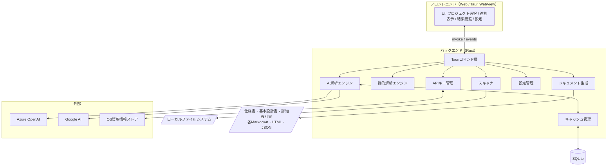
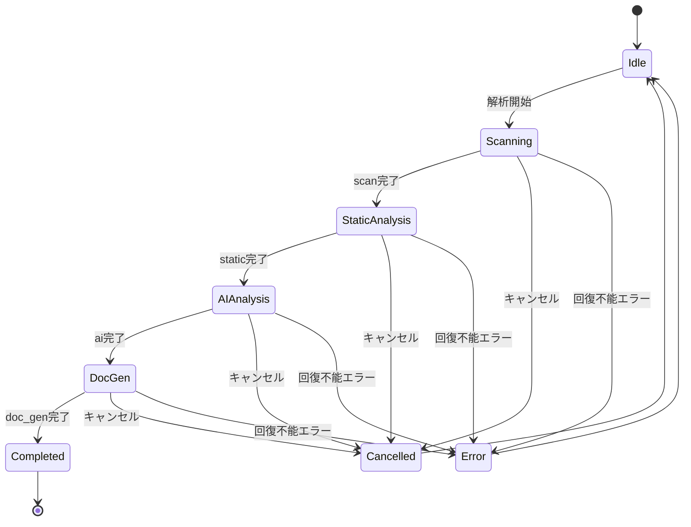
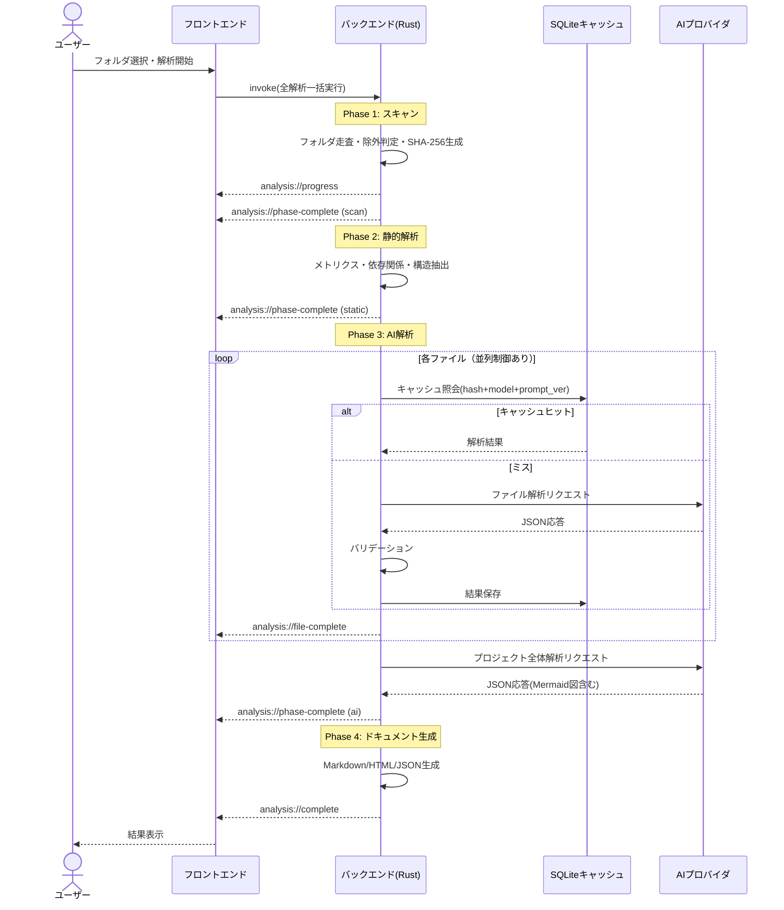
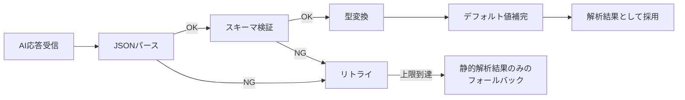
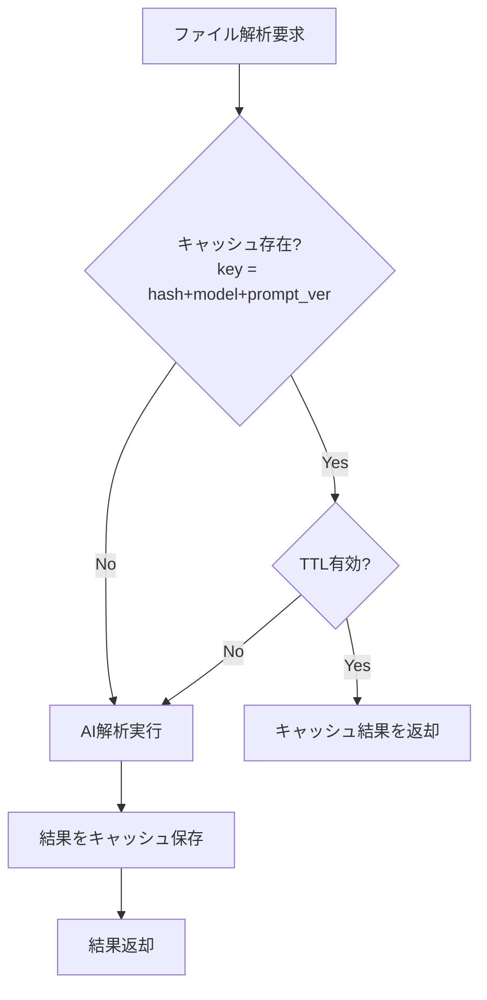
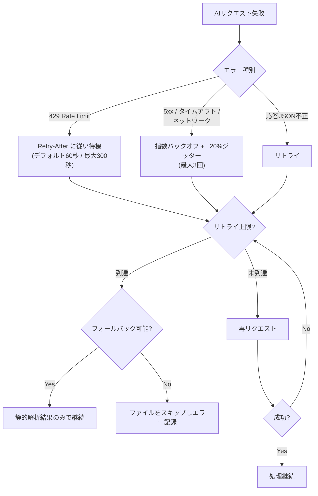

# ProjectLens 仕様書

| 項目 | 内容 |
|---|---|
| ドキュメント名 | ProjectLens 仕様書 |
| バージョン | 1.0.0 |
| 作成日 | 2026-08-05 |
| 関連文書 | 01_要件定義書.md / 03_設計書.md |

---

## 1. システム全体像

ProjectLens は Tauri ベースのデスクトップアプリであり、Rust バックエンドが解析処理を担い、Web フロントエンドが操作・可視化を担う。

---

## 2. 処理フロー仕様（4フェーズ）

### 2.1 フェーズ概要

| フェーズ | 名称 | 入力 | 出力 |
|---|---|---|---|
| 1 | スキャン (scan) | プロジェクトフォルダパス | 対象ファイルリスト + SHA-256ハッシュ |
| 2 | 静的解析 (static) | 対象ファイル | メトリクス・依存関係・関数/クラス構造 |
| 3 | AI解析 (ai) | ファイル内容 + 静的解析結果 | ファイル別解析結果 + プロジェクト全体解析結果 |
| 4 | ドキュメント生成 (doc_gen) | 全解析結果 | システム仕様書 / システム基本設計書 / 詳細設計書（ファイル単位）。各Markdown / HTML / JSON |

### 2.2 フェーズ遷移（状態遷移図）

### 2.3 全体シーケンス

---

## 3. 機能仕様

### 3.1 スキャン仕様

| 項目 | 仕様 |
|---|---|
| 走査方式 | プロジェクトフォルダの再帰走査 |
| 除外 | `.gitignore` 尊重 + ユーザー定義除外パターン |
| 上限 | ファイルサイズ上限 / ファイル数上限（設定可能） |
| 対応言語 | TypeScript / JavaScript / Rust / Python / Java / Go / C# / C / C++ 等 |
| ハッシュ | ファイル内容の SHA-256（キャッシュ判定用） |

### 3.2 静的解析仕様

| 解析項目 | 内容 |
|---|---|
| コードメトリクス | 行数、循環的複雑度、ネスト深度 等 |
| 構造抽出 | import/export 解析、関数・クラス抽出 |
| 依存関係 | 依存関係グラフ構築、fan-in/fan-out 算出、循環依存検出 |

### 3.3 AI解析仕様

#### ファイル単位解析の出力項目
| 項目 | 型 | 内容 |
|---|---|---|
| 役割要約 | string | ファイルの責務の要約 |
| 公開API | array | 外部公開している関数・クラス等 |
| 設計パターン | array | 検出された設計パターン |
| 重要度スコア | number (1-10) | プロジェクト内での重要度 |
| 潜在的問題 | array | 改善候補・リスク |

#### プロジェクト全体解析の出力項目

プロジェクト全体解析は、**システム仕様書**向けと**システム基本設計書**向けの2系統を1回のリクエストで出力する（実装詳細書§5.2/§11）。

| 区分 | 項目 | 内容 |
|---|---|---|
| システム仕様書向け | 目的 | システムが解決する課題（平易な日本語） |
| システム仕様書向け | 主要機能 | 機能名・説明（平易な日本語） |
| システム仕様書向け | 利用シーン | 主要な業務の流れ（平易な日本語） |
| システム基本設計書向け | アーキテクチャパターン | レイヤード / MVC 等の判定 |
| システム基本設計書向け | モジュール構成 | 主要モジュールと責務 |
| システム基本設計書向け | 技術スタック | 使用言語・フレームワーク・ライブラリ |
| システム基本設計書向け | データフロー | データの流れの説明（技術者向け） |
| システム基本設計書向け | 技術的負債 | 検出された負債と重大度 |
| システム基本設計書向け | Mermaid図 | アーキテクチャ・依存関係の図示ソース |

#### AIリクエスト制御
- 並列リクエスト数の制御（設定値に従う）
- リトライ（詳細は §6 エラーハンドリング）
- トークン上限管理（設定値を超えるファイルは分割またはスキップ）

### 3.4 プロンプト仕様

- ファイル解析用・プロジェクト解析用に、それぞれシステムプロンプト / ユーザープロンプトを定義する
- 応答は**厳密なJSON形式**を要求する
- プロンプトはセマンティックバージョニング（例: 1.2.0）で管理する
- 応答バリデーションパイプライン：

### 3.5 エクスポート仕様

| 項目 | 仕様 |
|---|---|
| 成果物 | システム仕様書 / システム基本設計書 / 詳細設計書（ファイル・RPAコンポーネント単位）の3種を個別に選択してエクスポート可能（実装詳細書§11） |
| 形式 | Markdown / HTML / JSON（成果物ごとに選択） |
| Mermaid | ソース埋め込みの有無を選択可能 |
| 出力先 | 設定で指定（デフォルト出力先あり）。成果物種別ごとにサブディレクトリへ出力（実装詳細書§11.2） |

---

## 4. キャッシュ仕様

| 項目 | 仕様 |
|---|---|
| キャッシュキー | ファイルハッシュ(SHA-256) + モデル名 + プロンプトバージョン |
| TTL | デフォルト30日（設定可能） |
| サイズ上限 | 設定可能。超過時は自動クリーンアップ |
| 無効化 | プロンプトバージョン変更時、該当キャッシュを自動無効化 |

---

## 5. インターフェース仕様

### 5.1 Tauriコマンド（フロントエンド → バックエンド）

| 分類 | コマンド | 概要 |
|---|---|---|
| 解析 | フォルダ選択 | OSダイアログでプロジェクトフォルダを選択 |
| 解析 | スキャン開始 | Phase 1 を実行 |
| 解析 | 静的解析 | Phase 2 を実行 |
| 解析 | AI解析（ファイル） | 指定ファイルのAI解析 |
| 解析 | AI解析（プロジェクト） | プロジェクト全体のAI解析 |
| 解析 | 全解析一括実行 | Phase 1〜4 を連続実行 |
| 解析 | キャンセル | 実行中の解析を中断 |
| 出力 | ドキュメントエクスポート | 仕様書/基本設計書/詳細設計書を指定形式で出力（詳細設計書はファイル・RPAコンポーネント単位で個別出力） |
| AI | AI接続テスト | プロバイダへの疎通確認 |
| 設定 | 設定の読込 / 保存 / リセット | config.json の操作 |
| 認証 | APIキー保存 / 取得 / 削除 | OS資格情報ストア経由 |
| キャッシュ | キャッシュ統計取得 / クリア | キャッシュ状態の確認・削除 |
| 履歴 | 解析履歴の取得 / 削除 | analysis_history の操作 |

### 5.2 Tauriイベント（バックエンド → フロントエンド）

| イベント名 | 発火タイミング | 主なペイロード |
|---|---|---|
| `analysis://progress` | 進捗更新時 | フェーズ、処理済み数/総数、現在ファイル |
| `analysis://phase-complete` | 各フェーズ完了時 | フェーズ名、所要時間 |
| `analysis://file-complete` | ファイル解析完了時 | ファイルパス、キャッシュヒット有無 |
| `analysis://error` | エラー発生時 | カテゴリ、メッセージ、回復可否 |
| `analysis://complete` | 全解析完了時 | サマリ（トークン数・所要時間等） |
| `analysis://cancelled` | キャンセル完了時 | 中断フェーズ |

---

## 6. エラーハンドリング仕様

### 6.1 エラーカテゴリと通知・リカバリ方針

| カテゴリ | 通知方法 | リカバリ方針 |
|---|---|---|
| スキャン | トースト | 読み取り不能ファイルはスキップし継続 |
| 静的解析 | トースト / なし | 解析不能ファイルはスキップし継続 |
| AI | トースト（致命時ダイアログ） | リトライ → 上限到達時はスキップ or フォールバック |
| キャッシュ | なし / トースト | キャッシュ無効として処理継続（AI再解析） |
| エクスポート | ダイアログ | 出力先・権限の確認を促す |
| 設定 | ダイアログ | デフォルト値へのリセットを提案 |

### 6.2 リトライ戦略

---

## 7. 設定仕様（config.json）

| セクション | 設定項目 |
|---|---|
| scan | 除外パターン、ファイルサイズ上限、ファイル数上限、対応拡張子 |
| ai | プロバイダ設定（Azure OpenAI / Google AI）、並列数、タイムアウト、リトライ、詳細レベル、トークン上限 |
| cache | 有効化フラグ、TTL、サイズ上限、自動クリーンアップ |
| export | デフォルト形式、デフォルト成果物種別（仕様書/基本設計書/詳細設計書）、出力先、Mermaid埋め込み |
| ui | テーマ、言語、最近のプロジェクト数 |

---

## 8. セキュリティ仕様

- APIキーは **OS資格情報ストア**（Windows Credential Manager / macOS Keychain / Linux Secret Service）経由で保存・取得・削除する
- config.json やSQLiteにAPIキーを平文保存しない
- 解析データ（キャッシュ・履歴）はローカルSQLiteのみに保存し、AIプロバイダ以外の外部送信を行わない
