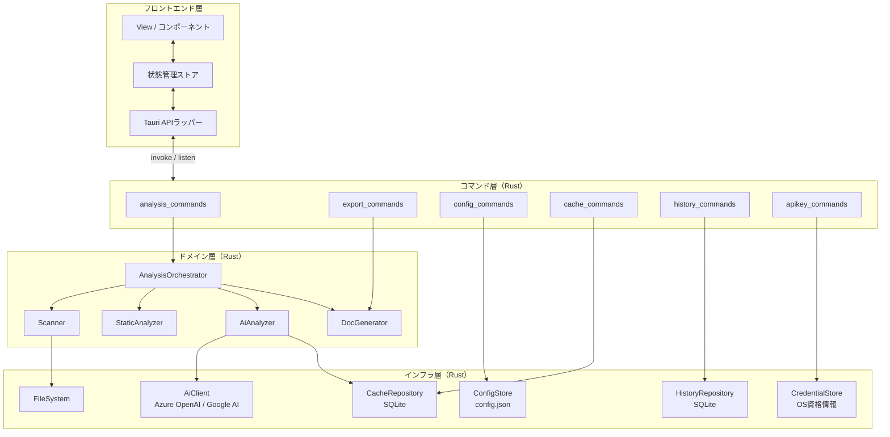
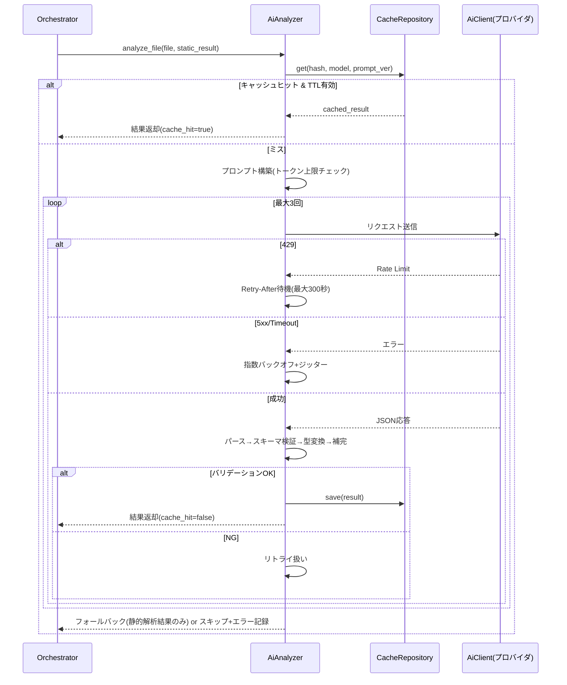
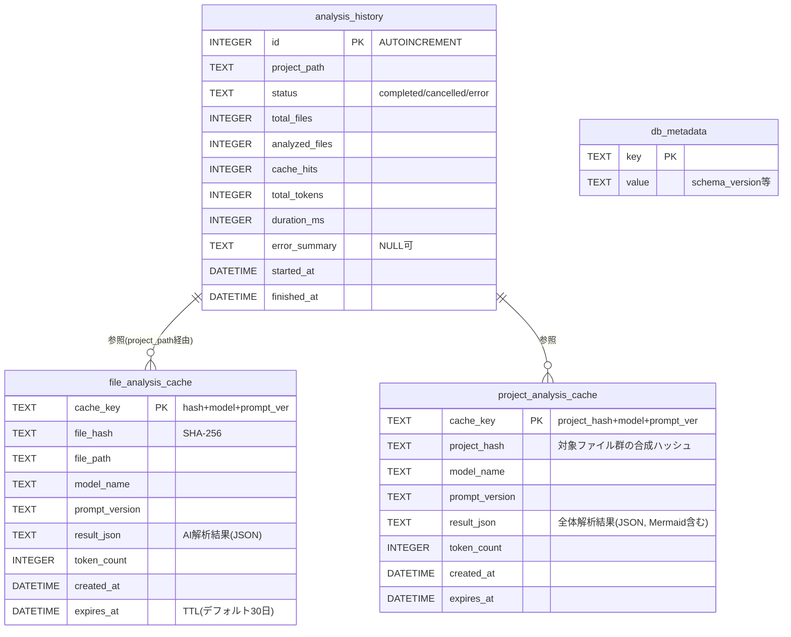
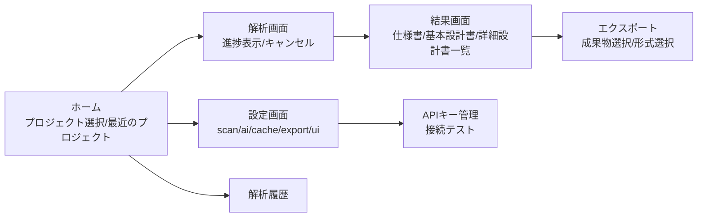
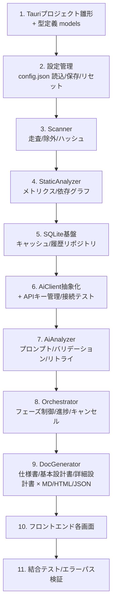

# ProjectLens 設計書

| 項目 | 内容 |
|---|---|
| ドキュメント名 | ProjectLens 設計書 |
| バージョン | 1.0.0 |
| 作成日 | 2026-08-05 |
| 関連文書 | 01_要件定義書.md / 02_仕様書.md |

---

## 1. アーキテクチャ設計

### 1.1 レイヤー構成

Tauri アプリとして、フロントエンド（WebView）とバックエンド（Rust）を IPC（invoke / events）で接続する。バックエンドはコマンド層・ドメイン層・インフラ層の3層で構成する。



### 1.2 設計方針

| 方針 | 内容 |
|---|---|
| 責務分離 | フェーズごとにドメインモジュールを分割し、Orchestrator が実行順序・進捗・キャンセルを一元管理する |
| 非同期処理 | AI解析は tokio による非同期並列処理とし、セマフォで並列数を制御する |
| キャンセル | CancellationToken を全フェーズに伝播し、任意タイミングで安全に中断する |
| キャッシュ優先 | AI解析前に必ずキャッシュを照会し、ヒット時はリクエストを発行しない |
| フォールバック | AI解析失敗時も静的解析結果のみでドキュメント生成を継続可能とする |
| プロバイダ抽象化 | AiClient を trait として定義し、Azure OpenAI / Google AI を実装として差し替え可能にする |

---

## 2. モジュール設計

### 2.1 バックエンド ディレクトリ構成（案）

```
src-tauri/src/
├── main.rs                 # エントリポイント・コマンド登録
├── commands/               # コマンド層
│   ├── analysis.rs
│   ├── export.rs
│   ├── config.rs
│   ├── cache.rs
│   ├── history.rs
│   └── apikey.rs
├── domain/                 # ドメイン層
│   ├── orchestrator.rs     # フェーズ制御・進捗・キャンセル
│   ├── scanner.rs          # スキャン
│   ├── static_analyzer/    # 静的解析（言語別パーサ）
│   ├── ai_analyzer/        # AI解析・プロンプト・バリデーション
│   └── doc_generator/      # システム仕様書/基本設計書/詳細設計書の生成（各Markdown/HTML/JSON）
├── infra/                  # インフラ層
│   ├── ai_client/          # Azure OpenAI / Google AI クライアント
│   ├── cache_repo.rs       # SQLiteキャッシュ
│   ├── history_repo.rs     # 解析履歴
│   ├── config_store.rs     # config.json
│   └── credential_store.rs # OS資格情報ストア
└── models/                 # 共通型定義（解析結果・設定・エラー）
```

### 2.2 主要コンポーネントの責務

| コンポーネント | 責務 |
|---|---|
| AnalysisOrchestrator | 4フェーズの実行制御、進捗イベント発火、キャンセル伝播、履歴記録 |
| Scanner | フォルダ走査、gitignore/除外パターン適用、上限判定、SHA-256生成 |
| StaticAnalyzer | 言語判定、メトリクス算出、import/export解析、依存グラフ構築、循環依存検出 |
| AiAnalyzer | プロンプト構築、キャッシュ照会、AIリクエスト（並列・リトライ）、応答バリデーション |
| DocGenerator | システム仕様書・システム基本設計書・詳細設計書（ファイル/コンポーネント単位）の3成果物の組み立て（実装詳細書§11）、Mermaid埋め込み、形式別レンダリング |
| AiClient (trait) | プロバイダ非依存のAI呼び出しインターフェース |

### 2.3 AI解析の内部シーケンス（リトライ含む）



---

## 3. データ設計（SQLite）

### 3.1 ER図



### 3.2 テーブル定義（DDL案）

```sql
CREATE TABLE IF NOT EXISTS file_analysis_cache (
    cache_key       TEXT PRIMARY KEY,
    file_hash       TEXT NOT NULL,
    file_path       TEXT NOT NULL,
    model_name      TEXT NOT NULL,
    prompt_version  TEXT NOT NULL,
    result_json     TEXT NOT NULL,
    token_count     INTEGER NOT NULL DEFAULT 0,
    created_at      DATETIME NOT NULL DEFAULT CURRENT_TIMESTAMP,
    expires_at      DATETIME NOT NULL
);
CREATE INDEX IF NOT EXISTS idx_fac_expires ON file_analysis_cache(expires_at);
CREATE INDEX IF NOT EXISTS idx_fac_prompt  ON file_analysis_cache(prompt_version);

CREATE TABLE IF NOT EXISTS project_analysis_cache (
    cache_key       TEXT PRIMARY KEY,
    project_hash    TEXT NOT NULL,
    model_name      TEXT NOT NULL,
    prompt_version  TEXT NOT NULL,
    result_json     TEXT NOT NULL,
    token_count     INTEGER NOT NULL DEFAULT 0,
    created_at      DATETIME NOT NULL DEFAULT CURRENT_TIMESTAMP,
    expires_at      DATETIME NOT NULL
);

CREATE TABLE IF NOT EXISTS analysis_history (
    id              INTEGER PRIMARY KEY AUTOINCREMENT,
    project_path    TEXT NOT NULL,
    status          TEXT NOT NULL,
    total_files     INTEGER NOT NULL DEFAULT 0,
    analyzed_files  INTEGER NOT NULL DEFAULT 0,
    cache_hits      INTEGER NOT NULL DEFAULT 0,
    total_tokens    INTEGER NOT NULL DEFAULT 0,
    duration_ms     INTEGER NOT NULL DEFAULT 0,
    error_summary   TEXT,
    started_at      DATETIME NOT NULL,
    finished_at     DATETIME
);

CREATE TABLE IF NOT EXISTS db_metadata (
    key   TEXT PRIMARY KEY,
    value TEXT NOT NULL
);
```

### 3.3 キャッシュ運用設計

- **キー生成**: `SHA-256(file_hash + ":" + model_name + ":" + prompt_version)`
- **無効化**: プロンプトバージョン変更検知時、`prompt_version` が旧バージョンの行を削除
- **クリーンアップ**: 起動時および定期実行で `expires_at < now` の行を削除。サイズ上限超過時は `created_at` 昇順で削除

---

## 4. 主要データ型設計（型定義案）

```typescript
// ファイル単位AI解析結果
interface FileAnalysisResult {
  filePath: string;
  roleSummary: string;          // 役割要約
  publicApis: PublicApi[];      // 公開API
  designPatterns: string[];     // 設計パターン
  importanceScore: number;      // 1-10
  potentialIssues: Issue[];     // 潜在的問題
  cacheHit: boolean;
}

// プロジェクト全体AI解析結果（システム仕様書・基本設計書の元データ。実装詳細書§5.2/§11）
interface ProjectAnalysisResult {
  systemSpec: {
    purpose: string;               // システムの目的（平易な日本語）
    mainFeatures: FeatureSummary[]; // 主要機能（平易な日本語）
    userFlows: string;             // 主要な利用シーン・業務の流れ（平易な日本語）
  };
  basicDesign: {
    architecturePattern: string;
    modules: ModuleSummary[];
    techStack: string[];
    dataFlow: string;
    technicalDebts: TechnicalDebt[];
    mermaidDiagrams: MermaidDiagram[]; // type: "architecture" | "dependency" 等
  };
}

// 静的解析結果
interface StaticAnalysisResult {
  filePath: string;
  language: string;
  metrics: { loc: number; cyclomaticComplexity: number; maxNestDepth: number };
  imports: string[];
  exports: string[];
  functions: FunctionInfo[];
  classes: ClassInfo[];
}

// 依存グラフ
interface DependencyGraph {
  nodes: { id: string; fanIn: number; fanOut: number }[];
  edges: { from: string; to: string }[];
  cycles: string[][]; // 循環依存
}

// 進捗イベント
interface ProgressPayload {
  phase: "scan" | "static" | "ai" | "doc_gen";
  processed: number;
  total: number;
  currentFile?: string;
}
```

---

## 5. プロンプト設計

### 5.1 管理方針

| 項目 | 設計 |
|---|---|
| バージョニング | セマンティックバージョニング（MAJOR.MINOR.PATCH）。出力スキーマ変更は MAJOR |
| 格納 | ソースコード内に定数として保持し、バージョン文字列を併記 |
| 応答形式 | 「JSONのみを返す（前置き・コードフェンス禁止）」を明示 |
| キャッシュ連動 | プロンプトバージョンがキャッシュキーに含まれるため、更新時に自動再解析 |

### 5.2 バリデーション設計

1. JSONパース（コードフェンス除去等の前処理を含む）
2. スキーマ検証（必須フィールド・型）
3. 型変換（数値範囲クランプ：重要度1-10 等）
4. デフォルト値補完（欠損フィールド）
5. 失敗時：リトライ → 上限到達で静的解析結果のみのフォールバック

---

## 6. フロントエンド設計

### 6.1 画面構成



### 6.2 画面別要件

| 画面 | 主な要素 |
|---|---|
| ホーム | フォルダ選択ボタン、最近のプロジェクト一覧（件数は設定値） |
| 解析画面 | フェーズ別進捗バー、現在処理中ファイル、キャンセルボタン、エラートースト |
| 結果画面 | 「システム仕様書」「システム基本設計書」「詳細設計書一覧」の3タブ構成。詳細設計書タブはファイル一覧（重要度ソート）から選択して個別プレビュー、Mermaid図レンダリング、循環依存警告（実装詳細書§11） |
| エクスポート | 成果物選択（仕様書/基本設計書/詳細設計書、複数選択可）、形式選択（MD/HTML/JSON）、Mermaid埋め込みトグル、出力先 |
| 設定画面 | config.json の各セクション編集、リセットボタン |
| APIキー管理 | プロバイダ選択、キー入力（マスク表示）、接続テストボタン |
| 解析履歴 | 履歴一覧（日時・ステータス・トークン数・所要時間）、削除 |

### 6.3 イベント購読設計

- 解析画面マウント時に `analysis://*` イベントを `listen` で購読し、アンマウント時に解除する
- 進捗はストアに集約し、画面遷移しても状態を保持する
- `analysis://error` は回復可否に応じてトースト / ダイアログを出し分ける

---

## 7. エラーハンドリング設計

### 7.1 エラー型設計（Rust）

```rust
#[derive(Debug, thiserror::Error, serde::Serialize)]
#[serde(tag = "category")]
pub enum AppError {
    #[error("scan error: {message}")]
    Scan { message: String, recoverable: bool },
    #[error("static analysis error: {message}")]
    Static { message: String, recoverable: bool },
    #[error("ai error: {message}")]
    Ai { message: String, recoverable: bool, retryable: bool },
    #[error("cache error: {message}")]
    Cache { message: String, recoverable: bool },
    #[error("export error: {message}")]
    Export { message: String, recoverable: bool },
    #[error("config error: {message}")]
    Config { message: String, recoverable: bool },
}
```

### 7.2 通知・リカバリ対応表

| カテゴリ | recoverable | 通知 | 動作 |
|---|---|---|---|
| Scan | true | トースト | 対象ファイルをスキップし継続 |
| Static | true | なし/トースト | スキップし継続 |
| Ai (retryable) | true | なし | リトライ戦略に従う |
| Ai (上限到達) | true | トースト | フォールバック or スキップ+記録 |
| Cache | true | なし | キャッシュ無効として再解析 |
| Export | false | ダイアログ | 処理中断・原因提示 |
| Config | false | ダイアログ | デフォルトリセット提案 |

---

## 8. 開発ガイド（Claude Code 向け）

### 8.1 推奨実装順序



### 8.2 完了条件（Definition of Done）

- 4フェーズの一括実行がサンプルプロジェクトに対して完走すること
- キャッシュヒット時にAIリクエストが発行されないことをログで確認できること
- 429 / 5xx / 応答不正の各パスでリトライ・フォールバックが仕様通り動作すること
- キャンセルが全フェーズで安全に機能すること
- システム仕様書・システム基本設計書・詳細設計書（ファイル/コンポーネント単位）の3成果物がそれぞれ独立して生成され、Markdown / HTML / JSON の3形式でエクスポートでき、Mermaid図が埋め込まれること（実装詳細書§11）
- APIキーがOS資格情報ストアにのみ保存されること
