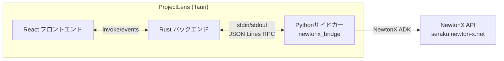
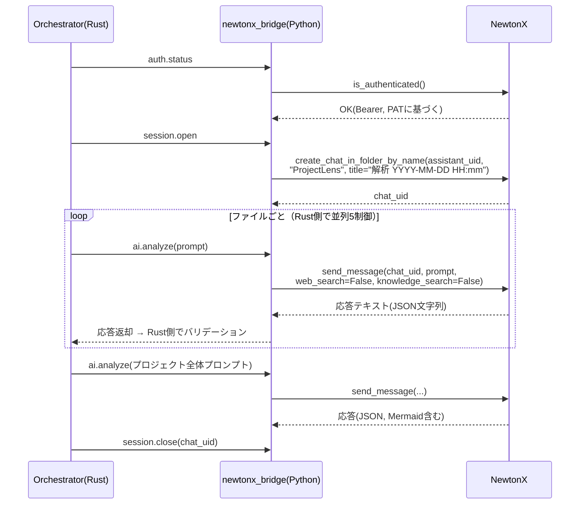
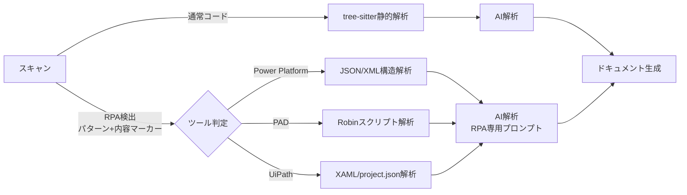

# ProjectLens 実装詳細書

| 項目 | 内容 |
|---|---|
| ドキュメント名 | ProjectLens 実装詳細書 |
| バージョン | 1.0.0 |
| 作成日 | 2026-08-05 |
| 位置づけ | 01〜03のドキュメントで未確定だった事項を確定させる。**本書の記載が 01〜03 と矛盾する場合は本書を優先する** |

---

## 1. 確定事項サマリ（インタビュー結果）

| 項目 | 決定内容 |
|---|---|
| フロントエンド | **React + TypeScript** |
| UI構築 | **Tailwind CSS + shadcn/ui** |
| 静的解析 | **tree-sitter 採用**（多言語対応） |
| 解析対象 | ソースコード（テキスト形式のプログラムファイル）+ **RPA定義ファイル（Power Platform）**。コンパイル済みバイナリ（exe/dll等）は対象外 |
| AIプロバイダ | **NewtonX（社内AI）のみ**。Azure OpenAI / Google AI は対応しない（trait抽象化は維持し将来追加可能とする） |
| デフォルト値方針 | **性能重視**（並列5・大規模プロジェクト前提） |
| 生成ドキュメント言語 | **日本語のみ** |
| 対象OS | **Windowsのみ** |
| アプリUI言語 | **日本語のみ**（locales は `ja.json` のみ作成。ただしi18n基盤は導入する） |
| 細部技術選定 | 下記 §2 の推奨構成で確定 |

---

## 2. 技術スタック確定版

| レイヤ | 技術 | バージョン方針 |
|---|---|---|
| デスクトップ基盤 | **Tauri v2** | 最新安定版 |
| バックエンド | Rust（stable最新） | tokio / serde / thiserror / rusqlite |
| フロントエンド | React 18+ / TypeScript 5+ | Vite ビルド |
| 状態管理 | **Zustand** | シンプルさ優先 |
| i18n | **react-i18next** | `ja.json` のみだが基盤は導入（ゼロハードコーディング原則の実現手段） |
| UI | Tailwind CSS + shadcn/ui | ダーク/ライトテーマ対応 |
| 図表 | Mermaid（`mermaid` npm） | 結果画面でのレンダリング用 |
| 静的解析 | tree-sitter（Rustバインディング） | 言語別文法: typescript / javascript / rust / python / java / go / c-sharp / c / cpp |
| DB | SQLite（rusqlite, bundled） | 設計書 §3.2 のDDL |

---

## 3. NewtonX 連携設計（最重要）

### 3.1 前提（NewtonX ADK 仕様の要点）

NewtonX は Python 製 ADK（`NewtonXClient`）経由で利用する社内AIであり、以下の特性を持つ。

| 特性 | 内容 | ProjectLensへの影響 |
|---|---|---|
| API形式 | 独自API（OpenAI互換ではない）。ADKがREST詳細を隠蔽 | **Rustから直接RESTを叩かず、Python ADKをサイドカーとして利用する** |
| 会話モデル | assistant → chat → message のチャット型 | 解析実行ごとにチャットを作成し、そこへメッセージ送信する設計にする |
| 認証 | **Personal Access Token（PAT）方式**（`newtonx_adk/docs/auth_setup_guide.md`で「最新版」と明記）。NewtonX Web版で発行したPAT + 会社サブドメイン（Host）を `ConfigManager.update_config(host=.., personal_access_token=.., auth_mode='none')` に設定すると、以後 `AuthManager.get_headers()` が `Authorization: Bearer <PAT>` を自動付与する。旧来のOAuth（client_id/tenant_id/ブラウザリダイレクト）経路も `ADKConfig` に残るが非推奨・未使用とする | 設計書（03）が元々想定していた「APIキー管理（OS資格情報ストア経由）」のUXがそのまま使える（§3.4）。PATは秘匿情報のため config.json ではなく OS資格情報ストアに保存する |
| 主要メソッド | `create_chat_in_folder_by_name` / `send_message` / `get_assistants` / `get_model_status` / `is_authenticated` | 接続テストは `is_authenticated()` + `get_model_status()` で実装（`authenticate_auto()` はOAuth専用の自動再認証であり、PAT方式では使用しない） |
| send_message既定値 | `web_search=True`, `knowledge_search=False` | **解析時は必ず `web_search=False` を明示指定する**（コード解析に外部検索は不要・結果の再現性確保） |
| タイムアウト/リトライ | ADK既定 `timeout=30`, `max_retries=3` | config から上書き設定する |
| 例外 | `AuthenticationError` / `APIError` / `ConfigurationError` 等 | §3.5 のエラーマッピングに従う |

### 3.2 統合方式：Python サイドカー

Rust バックエンドと NewtonX ADK（Python）は、**Tauri サイドカー**として同梱した Python プロセスを介して通信する。



- **サイドカー実体**: `newtonx_bridge.py` を PyInstaller で単一 exe 化し、Tauri の sidecar として同梱（対象はWindowsのみのため配布が単純）。ソースは `src-tauri/sidecar/`（`newtonx_bridge.py` + RPCメソッド名等の定数を集約した `constants.py`）に置く。**開発時点では PyInstaller化・Tauri sidecar登録は未実施**で、Rust側から `python src-tauri/sidecar/newtonx_bridge.py <config_file_path>` を子プロセスとして直接起動する暫定実装（`infra/ai_client/bridge.rs`）。配布方式確定後（§10 #4）にPyInstaller化・sidecar登録へ切り替える
- **プロトコル**: 標準入出力上の JSON Lines RPC（1行1リクエスト / 1行1レスポンス）
- **並行処理**（実装時に判明した重要事項）:
  - Rust側 `call()` は `config.ai.timeoutSecs` でラップする（`tokio::time::timeout`）。これがないとNewtonX側やネットワークが応答しない場合に解析全体が無期限にハングする（実際に発生した不具合。§3.5「タイムアウト」の実体化）
  - Python側 `main()` の標準入力読み取りループは、各RPCリクエストを**別スレッドで**ディスパッチする（`threading.Thread`）。同期ディスパッチのままだと1件のNewtonXリクエストが遅延した際に標準入力の読み取り自体が止まり、Rust側が並行送信した他の全リクエスト（`config.ai.concurrency`、既定5）も未処理のまま止まる（=`concurrency`設定が事実上無効化される。実際に発生した不具合）。標準出力への書き込みはロックで直列化し、JSON Lines（1行1レスポンス）が破損しないようにする
- **RPCメソッド**:

| RPCメソッド | 対応ADK呼び出し | 用途 |
|---|---|---|
| `auth.status` | `is_authenticated()` | 起動時・設定画面表示時の認証状態確認 |
| `auth.save_credentials` | `ConfigManager(config_file=<ProjectLens専用パス>).update_config(host=.., personal_access_token=.., auth_mode='none')` | 設定画面で入力されたHost/PATを反映（PAT本体はRust側からRPC引数として都度渡す。ディスクへの永続化はProjectLens専用configファイルのみで行う） |
| `auth.clear_credentials` | `update_config(personal_access_token="")` + `logout()` | 認証解除（設定画面の「PAT削除」操作） |
| `ai.test` | `get_model_status()` | 接続テスト |
| `ai.analyze` | `send_message(web_search=False, knowledge_search=False)` | 解析リクエスト（応答テキストを返す） |
| `session.open` | `create_chat_in_folder_by_name(assistant_uid, "ProjectLens", title, create_if_missing=True)` | 解析セッション用チャットを専用フォルダ内に作成（フォルダ自動作成・反映遅延リトライはADK組込） |
| `session.close` | `delete_chat()` | 解析用チャットの後始末 |
| `assistants.list` | `get_assistants()` | 設定画面のアシスタント選択用（`uid`/`name` を返す） |

- Rust 側 `AiClient` trait の実装 `NewtonXClient`（Rust側）は、このRPCを呼び出すラッパーとする。**trait のインターフェースは変更しない**（将来他プロバイダを追加可能）

### 3.3 解析セッション設計



設計上の注意:

- NewtonXはチャット型のため会話履歴が文脈に乗る。**ファイル解析は毎回自己完結したプロンプト**とし、前の応答に依存しない（`parent_order=0` のまま使用）
- `send_message` は **`web_search=False`（既定はTrue）と `knowledge_search=False` を必ず明示指定**する。Web検索が混入すると解析結果の再現性が失われ、アシスタントのナレッジ検索は解析対象外の情報を混入させるため
- 解析用チャットはADKのフォルダ機能で **専用フォルダ「ProjectLens」配下に作成**する（`create_chat_in_folder_by_name` は フォルダ自動作成・反映遅延への待機リトライを内蔵）。ユーザーのチャット一覧を汚さず、万一削除漏れが起きてもフォルダ単位で整理・一括削除できる
  - **【検証済みの既知の問題】** `create_chat_in_folder_by_name`（内部で`GET /folders`を呼ぶ）が401を返すケースで、ADK側の自動再認証フォールバックがOAuth/MSAL経路に入り、PAT運用（`tenant_id`未設定）では認証URLの構築に失敗して例外を送出することを実機で確認した（エラー例:「フォルダ一覧取得エラー: Your given address (https://login.microsoftonline.com/) should consist of an https url with hostname...」）。原因はADK内部（フォルダ系APIの401時フォールバックがauth_mode='none'を完全に尊重していない）と推測され、こちら側では修正できない
  - **対応**: `session.open`はフォルダ配置に失敗した場合、フォルダなしの通常チャット（`create_chat`）にフォールバックする（`newtonx_bridge.py::handle_session_open`）。専用フォルダへの整理は付加価値であり解析機能の前提条件ではないため、この劣化運用で解析自体は継続できる
- 解析セッション終了時（完了・キャンセル・エラー時とも）に `session.close` を必ず実行し、NewtonX側にゴミチャットを残さない
- `assistant_uid` は設定項目とする（config.ai.newtonx.assistant_uid）。初回設定時に `get_assistants` の一覧から選択できるUIを設ける
- **既定アシスタント**: `GPT-5.4(高性能)`（uid: `d18ad1c0-c7e6-4651-9ff2-4fe86af1a73b`）。選定理由:
  - `web_search=False` / `knowledge_search=False` を必ず明示指定する設計（本節）のため、固有ナレッジベースに紐づくアシスタント（社内情報検索・継続研修・スキルアセスメント等）はそのナレッジを利用できず不適。汎用モデルベースのアシスタントから選定する
  - コード/RPA構造の横断解析と厳密なJSON出力、および具体的な改善提案（`potentialIssues.suggestion` / `technicalDebts.recommendation`、§5.1/§5.2）が求められるため、「複雑なタスクの整理や具体的な提案」に適した高性能モデルを既定とする
  - ユーザーが設定画面から他のアシスタント（例: 用途に応じ `GPT-5 mini(高速)` 等）へ変更できること（ゼロハードコーディング原則）

### 3.4 認証設計（PAT方式。設計書§2.2のAPIキー管理をそのまま踏襲）

`newtonx_adk/docs/auth_setup_guide.md` で「最新版」と明記されているとおり、実際のNewtonX ADK認証は **Personal Access Token（PAT）** 方式であり、旧OAuthブラウザフロー（client_id/tenant_id/`localhost:8400`リダイレクト）は使用しない。これにより、設計書（03設計書§1.1/§2.1）が元々想定していた「OS資格情報ストアによるAPIキー管理（`credential_store.rs`）」の設計をそのまま踏襲できる。**旧OAuth前提の設計（本節旧版）は撤回する。**

| 項目 | 設計 |
|---|---|
| 設定入力 | 設定画面で「Host（会社サブドメイン、例: `seraku`）」と「Personal Access Token」を入力。PATはNewtonX Web版のアカウントメニュー「アクセストークン」から発行する運用（`auth_setup_guide.md`手順） |
| PAT保存先 | **OS資格情報ストア**（Windows Credential Manager）に保存する（`credential_store.rs`、NFR-07）。config.jsonには平文保存しない |
| Host保存先 | 秘密情報ではないため `config.ai.newtonx.host` として config.json に保存する |
| サイドカーへの受け渡し | Rustが起動時・接続テスト時にOS資格情報ストアからPATを読み出し、`auth.save_credentials` RPC引数として都度Pythonサイドカーへ渡す（PATをコマンドライン引数や環境変数に載せない。ログにも出力しない） |
| サイドカー側の反映 | `ConfigManager(config_file=<ProjectLens専用パス、例: %APPDATA%/ProjectLens/newtonx_adk_config.json>)` を使い、ADK共通の `~/.newtonx/config.json` とは分離する。`update_config(host=.., personal_access_token=.., auth_mode='none')` で反映。ADKの内部実装上この専用configファイルにもPATが書き込まれるため、ファイルはユーザープロファイル配下（他ユーザーから読めない場所）に限定し、アプリのアンインストール/資格情報削除時に併せて削除する（残課題として§10に追記） |
| 認証確認 | `is_authenticated()` の戻り値、または `get_headers()` の `Authorization` ヘッダー有無で判定。PATは（OAuthトークンと異なり）自動失効・自動更新の概念がないため `authenticate_auto()` は使用しない |
| 認証解除 | 設定画面の「PAT削除」操作で `auth.clear_credentials` RPCを実行し、OS資格情報ストア・サイドカー側config双方からPATを消去する |
| コマンド名 | 03設計書の `apikey_commands` の考え方を踏襲しつつ、NewtonX固有のRPC呼び出しを伴うため実装は `commands/apikey.rs` に集約する（§7のコマンドシグネチャ参照）。ブラウザ認証を伴わないため「ログイン」という語は使わない |

### 3.5 エラーマッピング（仕様書§6 リトライ戦略との対応）

| NewtonX ADK例外・応答パターン | 分類 | 対応 |
|---|---|---|
| `AuthenticationError` | 認証切れ・PAT不正 | 自動再認証手段はない（PAT方式のため）。リトライせず即座にダイアログで「設定画面でPATを確認/再設定してください」を促し解析を一時停止 |
| `APIError`（レート制限起因） | 429相当 | 待機（config.ai.retry_after_secs、デフォルト60秒・最大300秒）→ リトライ |
| `APIError`（その他通信） | 5xx/ネットワーク相当 | 指数バックオフ+±20%ジッター（最大3回） |
| タイムアウト | タイムアウト | 同上 |
| 応答JSON不正 | 応答不正 | リトライ → 上限到達で静的解析結果のみのフォールバック |
| `send_message` が `None` を返す（例外なしのサイレント失敗） | 無応答 | **リトライではなくチャットを作り直す**（`skills/newtonx-adk/reference_response_reliability.md`推奨）。`session.close` → `session.open` をやり直した上で1回だけ再試行。失敗時はファイルスキップ+エラー記録 |
| 応答がトークン上限で途中切れ（JSON末尾が不完全） | 応答途中切れ | 応答不正と同様にリトライ対象とする。上限到達時は静的解析結果のみのフォールバック。恒常的に発生する場合は `config.ai.maxTokensPerFile` を下げる運用で対応（継続応答ループでの回収は本バージョンでは実装しない） |
| `ChatError` | チャット操作エラー | セッション再作成（`session.open` やり直し）を1回試行 → 失敗時はAIフェーズ中断・エラー記録 |
| `ConfigurationError` | 設定エラー | ダイアログ表示・設定画面へ誘導 |
| `NewtonXError`（上記以外の基底例外） | 不明エラー | 指数バックオフ側で1回リトライ → 失敗時はファイルスキップ+エラー記録 |

※ ADKの `APIError` は `status_code` 属性が空のことが多く（実装確認済み。`_make_request` は非200応答時にメッセージ文字列のみで `APIError` を送出するケースがある）、レート制限とその他通信エラーを区別できない場合が多い。ブリッジ側でエラーメッセージ文字列から可能な範囲で判別し、判別不能時は指数バックオフ側で扱う（04§10残課題#3）。
※ `FileUploadError` はProjectLensでは発生しない想定（コードはメッセージ本文として送信し、ファイルアップロード機能を使用しないため）。発生した場合は `NewtonXError` と同様に扱う。

---

## 4. config.json デフォルト値（性能重視・確定版）

```json
{
  "scan": {
    "excludePatterns": ["node_modules", "target", "dist", "build", ".git", "vendor", "__pycache__"],
    "maxFileSizeKb": 1024,
    "maxFileCount": 5000,
    "extensions": [".ts", ".tsx", ".js", ".jsx", ".rs", ".py", ".java", ".go", ".cs", ".c", ".cpp", ".h", ".hpp"],
    "rpa": {
      "enabled": true,
      "tools": ["powerplatform", "pad", "uipath"],
      "detectionPatterns": {
        "powerplatform": ["solution.xml", "customizations.xml", "Workflows/*.json", "*.msapp", "CanvasApps/**/*.json"],
        "pad": ["*.robin", "*.pad.txt"],
        "uipath": ["project.json", "*.xaml"]
      },
      "maxFileSizeKb": 4096
    }
  },
  "ai": {
    "provider": "newtonx",
    "newtonx": {
      "host": "seraku.newton-x.net",
      "assistantUid": "d18ad1c0-c7e6-4651-9ff2-4fe86af1a73b"
    },
    "concurrency": 5,
    "timeoutSecs": 90,
    "maxRetries": 3,
    "retryAfterSecs": 60,
    "retryAfterMaxSecs": 300,
    "detailLevel": "standard",
    "maxTokensPerFile": 8000,
    "outputLanguage": "ja"
  },
  "cache": {
    "enabled": true,
    "ttlDays": 30,
    "maxSizeMb": 500,
    "autoCleanup": true
  },
  "export": {
    "defaultFormat": "markdown",
    "defaultDocTypes": ["systemSpec", "basicDesign", "detailDesign"],
    "outputDir": "",
    "embedMermaid": true
  },
  "ui": {
    "theme": "system",
    "language": "ja",
    "recentProjectsCount": 10
  }
}
```

補足:

- `newtonx.host` は秘密情報ではないため config.json に保存する。**Personal Access Token（PAT）はここに含めない**。OS資格情報ストアに保存し、実行時にRustが読み出してサイドカーへ渡す（§3.4）
- `assistantUid` の既定値 `d18ad1c0-c7e6-4651-9ff2-4fe86af1a73b` は `GPT-5.4(高性能)`。選定理由は §3.3 参照。ユーザーは設定画面で `get_assistants` 一覧から変更可能（ゼロハードコーディング原則）
- `concurrency: 5` は性能重視の初期値。NewtonXのレート制限仕様が不明なため、**APIErrorが頻発する場合は設定画面から下げられること**（ゼロハードコーディング原則）
- `timeoutSecs: 90` — ADK既定30秒では大きなファイルの解析に不足するため上書き
- `outputDir` 空文字時は「プロジェクトフォルダ/projectlens-docs/」を既定とする（この既定パス文字列も constants に定義）。配下のディレクトリ構成は §11 参照

---

## 5. AI応答JSONスキーマ（確定版）

### 5.1 ファイル単位解析

```json
{
  "roleSummary": "string: このファイルの責務の要約（日本語・200字以内）",
  "publicApis": [
    { "name": "string", "kind": "function|class|const|type", "description": "string" }
  ],
  "designPatterns": ["string"],
  "importanceScore": 5,
  "potentialIssues": [
    { "severity": "high|medium|low", "description": "string", "suggestion": "string" }
  ]
}
```

### 5.2 プロジェクト全体解析

プロジェクト全体解析のAI応答は、**成果物3種（§11「出力ドキュメント設計」参照）のうち「システム仕様書」と「システム基本設計書」の2つの元データを1回のリクエストで生成する**。トップレベルを `systemSpec`（仕様書向け・平易な日本語）と `basicDesign`（基本設計書向け・技術用語可）に分離し、DocGeneratorがそれぞれを別ドキュメントとして組み立てる（詳細設計書側は §5.1 のファイル単位解析結果を使用）。

```json
{
  "systemSpec": {
    "purpose": "string: システムが解決する課題・存在意義（平易な日本語、非エンジニアが読める表現）",
    "mainFeatures": [
      { "name": "string: 機能名（平易な日本語）", "description": "string: 何ができるかの説明（平易な日本語）" }
    ],
    "userFlows": "string: 主要な利用シーン・業務の流れの説明（平易な日本語）"
  },
  "basicDesign": {
    "architecturePattern": "string",
    "modules": [
      { "name": "string", "responsibility": "string", "keyFiles": ["string"] }
    ],
    "techStack": ["string"],
    "dataFlow": "string: データの流れの説明（技術者向け）",
    "technicalDebts": [
      { "severity": "high|medium|low", "area": "string", "description": "string", "recommendation": "string" }
    ],
    "mermaidDiagrams": [
      { "type": "architecture|dependency|dataflow", "title": "string", "source": "string: mermaidソース" }
    ]
  }
}
```

バリデーション規則（設計書§5.2の具体化）:

- `importanceScore` は 1〜10 にクランプ。数値変換不能時は 5 で補完
- `severity` が列挙外の場合は `medium` で補完
- 必須トップレベルキー（`systemSpec` / `basicDesign` およびその必須フィールド）欠損は「応答不正」としてリトライ対象
- 応答前後のコードフェンス（```json 等）・前置き文は前処理で除去してからパース

※ `systemSpec` は非エンジニアが単独で読めることを最優先し、`basicDesign` はモジュール名・アーキテクチャ用語等の技術的正確性を優先する。プロンプト側（§6.2）で両者のトーンを明示的に指示する。

---

## 6. プロンプト定義（v1.1.0）

プロンプトは `src-tauri/src/domain/ai_analyzer/prompts.rs` に定数として定義し、`PROMPT_VERSION = "1.1.0"` を併記する（キャッシュキー連動）。

※ v1.0.0 → v1.1.0: プロジェクト全体解析の出力を `systemSpec` / `basicDesign` に分離（§5.2、§8-2「出力ドキュメント設計」対応）。出力スキーマ変更のため MAJOR 相当だが、初期開発段階（実運用キャッシュ未蓄積）のため MINOR 更新とする。

### 6.1 ファイル解析プロンプト（テンプレート）

```
あなたはソフトウェアアーキテクチャの専門家です。以下のソースコードファイルを解析してください。

# 制約
- 応答は指定するJSON形式のみで返すこと。前置き・説明文・コードフェンスは一切含めないこと
- すべての文字列値は日本語で記述すること
- 推測で断定せず、コードから読み取れる事実に基づくこと

# 出力JSON形式
{5.1のスキーマをここに展開}

# ファイル情報
- パス: {file_path}
- 言語: {language}
- 静的解析結果: 行数={loc}, 循環的複雑度={complexity}, 関数={functions}, クラス={classes}

# ソースコード
{file_content}
```

### 6.2 プロジェクト全体解析プロンプト（テンプレート）

```
あなたはソフトウェアアーキテクチャの専門家です。以下のプロジェクト情報全体を俯瞰し、「システム仕様書」と「システム基本設計書」の元データをそれぞれ生成してください。

# 制約
- 応答は指定するJSON形式のみで返すこと。前置き・説明文・コードフェンスは一切含めないこと
- すべての文字列値は日本語で記述すること
- `systemSpec` 配下は非エンジニアが読んでも理解できる平易な日本語で記述し、専門用語（アーキテクチャパターン名・モジュール名等のコード上の固有名詞を除く）は避けること
- `basicDesign` 配下は開発者向けとして、技術用語を正確に用いて記述すること
- basicDesign.mermaidDiagrams.source は有効なMermaid記法であること

# 出力JSON形式
{5.2のスキーマをここに展開}

# プロジェクト情報
- ルート: {project_root}
- ファイル数: {file_count} / 言語構成: {language_stats}
- 依存関係グラフ要約: {dependency_summary}（循環依存: {cycles}）
- 各ファイルの解析要約:
{file_summaries}
```

※ `{file_summaries}` はトークン上限（config.ai.maxTokensPerFile 相当の全体上限）内に収まるよう、重要度スコア上位から採用する。

---

## 7. Tauriコマンド シグネチャ確定版

```typescript
// フロントエンド側 型付きラッパー（src/lib/tauri.ts）に定義する
// Rust側は同名の #[tauri::command] を実装する

// --- 解析 ---
select_project_folder(): Promise<string | null>
start_full_analysis(args: { projectPath: string }): Promise<AnalysisSummary>
// 直近の解析結果（システム仕様書/基本設計書/ファイル別結果）を取得する。結果画面表示用。
// start_full_analysisの戻り値がAnalysisSummary（集計値のみ）のため別途必要（初版実装で追加）
get_last_analysis_result(): Promise<{ projectResult: ProjectAnalysisResult, fileResults: FileAnalysisResult[] } | null>
// start_scan / run_static_analysis / run_ai_file_analysis / run_ai_project_analysis は
// フェーズ単体実行用の将来拡張コマンドとして設計されていたが、初版実装では
// start_full_analysis（4フェーズ一括）のみを実装している（未実装。単体実行が必要になった時点で追加する）
cancel_analysis(): Promise<void>

// --- エクスポート ---
// docTypes: 出力する成果物種別（複数選択可）。detailDesign を含む場合、対象ファイル数分のドキュメントが個別出力される（§11）
export_document(args: {
  format: "markdown" | "html" | "json",
  docTypes: ("systemSpec" | "basicDesign" | "detailDesign")[],
  embedMermaid: boolean,
  outputDir?: string
}): Promise<{ outputDir: string, files: ExportedFile[] }>

interface ExportedFile {
  docType: "systemSpec" | "basicDesign" | "detailDesign";
  path: string;           // 出力ファイルの絶対パス
  sourceFilePath?: string; // docType=detailDesign の場合のみ、元ファイル/RPAコンポーネントのパス
}

// --- NewtonX認証・接続（PAT方式。§3.4） ---
newtonx_auth_status(): Promise<{ authenticated: boolean }>
save_newtonx_credentials(args: { host: string, personalAccessToken: string }): Promise<{ success: boolean }> // PATをOS資格情報ストアへ保存
clear_newtonx_credentials(): Promise<void> // OS資格情報ストアからPATを削除
newtonx_list_assistants(): Promise<{ uid: string, name: string }[]>
test_ai_connection(): Promise<{ ok: boolean, message: string }>

// --- 設定 ---
load_config(): Promise<AppConfig>
save_config(args: { config: AppConfig }): Promise<void>
reset_config(): Promise<AppConfig>

// --- キャッシュ・履歴 ---
get_cache_stats(): Promise<{ fileEntries: number, projectEntries: number, sizeMb: number }>
clear_cache(): Promise<void>
get_analysis_history(args: { limit?: number }): Promise<AnalysisHistoryEntry[]>
delete_analysis_history(args: { id: number }): Promise<void>
```

---

## 8. RPA解析設計（Power Platform / PAD / UiPath）

### 8.1 対応ツールと検出方式

| ツール | 対象ファイル | 検出方式 |
|---|---|---|
| **Power Platform**（Power Automate クラウドフロー / Power Apps） | ソリューションエクスポート（アンパック済み）内の `solution.xml` / `customizations.xml` / `Workflows/*.json` / `CanvasApps/**/*.json` | パス構造パターン + JSON内スキーマキー（`$schema` / `definition` 等）で確認 |
| **Power Automate for Desktop（PAD）** | Robinスクリプト形式のフローファイル（`*.robin`、またはアクションをコピー&テキスト保存した `*.pad.txt`） | 拡張子 + 内容マーカー（Robin構文のアクションドット記法 `Display.ShowMessage` 等）で確認 |
| **UiPath** | プロジェクト定義 `project.json` + ワークフロー `*.xaml` | `project.json` はUiPath固有キー（`studioVersion` / `main` / `dependencies`）で判定。`*.xaml` はXML名前空間（UiPath.Core / Workflow Foundation）で判定 |

共通方針:

- **拡張子の無差別対象化はしない**（`.json` / `.xml` / `.txt` は一般ファイルと衝突するため、必ず内容マーカーまで確認して誤検出を防ぐ）。判定ロジックは各 `RpaAnalyzer` 実装の `detect()` に集約する（DRY）
- 検出パターンは config.scan.rpa.detectionPatterns で変更可能（ゼロハードコーディング）
- 拡張性: `RpaAnalyzer` trait を定義し、4種目以降のツール追加は実装追加のみで済む構造とする

### 8.1.2 ツール別の前提・制約

| ツール | 前提・制約 |
|---|---|
| Power Platform | 解析対象はアンパック済みエクスポート。`.msapp`（zip形式）は検出時にアンパックを促すメッセージを表示（v1では自動展開しない） |
| PAD | PADのフローは通常クラウド/ローカルDB保存であり、ファイルとして直接エクスポートできない。**「フローのアクションを全選択コピー→テキストファイル保存（Robinスクリプト）」の運用を利用ガイドに明記**する。ソリューションエクスポート経由の場合はPower Platform側の検出で拾う |
| UiPath | プロジェクトフォルダごと配置されている前提。`project.json` をルートとして配下の `.xaml` を同一プロジェクトに関連付け、`Main.xaml` をエントリポイントとして依存グラフに組み込む |

### 8.2 処理フローへの組み込み

RPAファイルは4フェーズの枠組みをそのまま流用し、静的解析のみツール別パーサに差し替える。



### 8.3 RPA構造解析の抽出項目（共通中間表現）

3ツールの解析結果は共通の中間表現に正規化する（ドキュメント生成・依存グラフ側の処理を1本化するため。DRY原則）。

| 共通項目 | Power Platform | PAD | UiPath |
|---|---|---|---|
| フロー名/種別 | フロー名、自動化/スケジュール/インスタント | フロー名（ファイル名）、デスクトップフロー | プロジェクト名、プロセス/ライブラリ |
| トリガー | trigger定義（イベント/スケジュール/手動） | 呼び出し元（クラウドフロー連携等、判別可能な場合） | `Main.xaml` エントリポイント |
| ステップ | アクション一覧・数 | Robinアクション一覧・数 | アクティビティ一覧・数 |
| 分岐/ループ | condition / apply_to_each | IF / LOOP / ON ERROR | If / While / ForEach / TryCatch |
| 外部接続 | コネクタ（SharePoint / Dataverse / Outlook 等）と接続参照 | 操作対象アプリ・モジュール（Excel / ブラウザ / UI要素等） | アクティビティパッケージ（Excel / Mail / Browser 等） |
| 依存関係 | 子フロー呼び出し、環境変数、参照テーブル | サブフロー呼び出し | Invoke Workflow File による `.xaml` 間参照、`project.json` の dependencies |

※ 循環的複雑度に相当する指標として「分岐・ループ数」を算出し、コードと同じメトリクス欄に載せる。
※ フロー間・ワークフロー間の呼び出しは、コードの依存関係グラフと同じ形式（fan-in / fan-out）に載せる。

### 8.4 RPA用AI解析

- **専用プロンプト**を `prompts.rs` に追加定義する（`RPA_PROMPT_VERSION` として独立管理。コード用プロンプト変更でRPAキャッシュが無効化されないようにするため）。プロンプトは**3ツール共通**とし、§8.3の正規化済み中間表現+定義ファイル原文を入力する
- 出力スキーマは §5.1 を流用しつつ、`publicApis` を「トリガー/主要アクション」、`designPatterns` を「フローパターン（承認フロー/通知/データ同期/画面自動操作等）」として解釈させる。この結果は**詳細設計書（RPAコンポーネント単位、§11）**の元データとなる
- プロジェクト全体解析では、RPAフローとコードの両方を含めた全体像（例：Power Apps→Dataverse→クラウドフロー→PAD→基幹システム画面操作、UiPathからのAPI呼び出し等）を `basicDesign.dataFlow` / Mermaid図に反映する。また `systemSpec.mainFeatures` にも、RPAフローが担う業務機能（承認フロー等）を平易な日本語で含める

### 8.5 テスト活用（要件定義の目的との対応）

生成ドキュメントのうち、トリガー・分岐条件・外部接続（コネクタ/操作対象アプリ/アクティビティ）一覧は**テスト観点の洗い出し**（分岐網羅・外部接続の異常系・画面変更影響）に直接利用できる。ホワイトボックステスト設計のインプットとしての利用を想定する。

---

## 9. 01〜03ドキュメントからの変更点一覧

| 対象 | 変更前 | 変更後（本書） |
|---|---|---|
| AIプロバイダ | Azure OpenAI / Google AI | **NewtonX（社内AI）のみ**。Pythonサイドカー経由 |
| APIキー管理 | OS資格情報ストアに保存 | **変更なし**。NewtonXはPersonal Access Token（PAT）方式のため、設計書§2.2の想定どおりOS資格情報ストアに保存する（§3.4）。中間で検討したOAuthブラウザ認証案は撤回 |
| AI接続テスト | プロバイダAPIへの疎通 | `is_authenticated()` + `get_model_status()` |
| 対象OS | 未定義 | **Windowsのみ** |
| 出力言語 | 未定義 | 生成ドキュメント・UIとも**日本語のみ**（i18n基盤は導入） |
| 静的解析方式 | 未定義 | **tree-sitter** |
| フロント技術 | 未定義 | React + TS + Zustand + react-i18next + Tailwind + shadcn/ui |
| 解析対象 | ソースコードのみ | ソースコード + **RPA定義ファイル（Power Platform / PAD / UiPath）**（FR-12として要件定義書に追加済み） |
| 出力ドキュメント構造 | MD/HTML/JSON形式 × セクション選択による**単一の統合ドキュメント** | **システム仕様書・システム基本設計書・詳細設計書（ファイル/コンポーネント単位）の3成果物**を独立して生成（§11、FR-05改訂） |

---

## 10. 残課題（開発中に確認が必要な事項）

| # | 課題 | 対応方針 |
|---|---|---|
| 1 | NewtonXのレート制限の実値（並列5が許容されるか） | 開発初期に小規模プロジェクトで実測し、必要なら concurrency 既定値を調整 |
| 2 | NewtonXの最大入力トークン（メッセージ長上限） | 実測のうえ `maxTokensPerFile` を調整。超過ファイルは分割 or 静的解析のみ |
| 3 | `APIError` からのレート制限判別可否 | ブリッジ実装時にエラーメッセージ内容を確認して判別ロジックを実装 |
| 4 | Pythonサイドカーの配布方式（PyInstaller同梱の社内配布可否） | 社内のセキュリティポリシーを確認 |
| 5 | 解析対象コードを社内AIへ送信することの承認 | NewtonXは社内AIのため外部送信リスクは低いが、念のため運用ルールを確認 |
| 6 | 実物のRPA定義ファイルの構造確認 | **3ツールそれぞれのサンプルを用意**する：Power Platformソリューションエクスポート（アンパック済み）/ PADフローのRobinスクリプト保存 / UiPathプロジェクトフォルダ。detectionPatterns と抽出ロジックを実物で検証する |
| 7 | 詳細設計書をファイル単位で個別出力する方式（§11）における、大規模プロジェクト（ファイル数千件）でのエクスポート所要時間・出力ファイル数の実用性 | 開発中に実測し、必要であれば ZIP 一括出力や出力対象の絞り込みUIの追加を検討する |
| 8 | 【検証済み】ADKの `ConfigManager.update_config(personal_access_token=..)` は実際に `personal_access_token` フィールドへ平文で書き込み、ProjectLens専用configファイルに平文コピーが残ることを実機確認した（回避手段は見つからず。ADKに環境変数注入等の代替手段はない）。§3.4の想定どおり | ファイルのアクセス権限を最小化し、資格情報削除時・アプリ終了時の消去処理を徹底する。実装済み（`auth.clear_credentials` が `personal_access_token=""` で上書きすることを確認済み） |
| 9 | 【検証済み】ADKの `AuthManager.logout()` は内部で「ログアウトしました。」を**標準出力に直接print**する（stderrではない）。「stdoutにはRPC応答以外を出力しない」設計（CLAUDE.md §5）に反する挙動だが、`newtonx_bridge.py`/`bridge.rs` 側でJSONとしてパースできない行を無視する安全策があるため、RPC通信自体への実害はない | 実装済み（無視ロジック）。将来的に `logout()` 呼び出し中のみ `sys.stdout` を一時リダイレクトする対応を検討 |

---

## 11. 出力ドキュメント設計（3成果物）

### 11.1 成果物の定義

01_要件定義書§4.2（FR-05改訂）のとおり、ProjectLensは1回の解析から**独立した3種類のドキュメント**を生成する。いずれも §7 の `export_document` で形式（Markdown/HTML/JSON）を選択してエクスポートできる。

| 成果物 | 対象読者 | 元データ | 生成単位 |
|---|---|---|---|
| システム仕様書 | 非エンジニア／開発エンジニア共通（平易な日本語） | `ProjectAnalysisResult.systemSpec`（§5.2） | プロジェクト全体で1ドキュメント |
| システム基本設計書 | 開発エンジニア | `ProjectAnalysisResult.basicDesign`（§5.2） | プロジェクト全体で1ドキュメント |
| 詳細設計書 | 開発エンジニア | `FileAnalysisResult`（§5.1）+ 対応する `StaticAnalysisResult`（設計書§4） | **ファイル/RPAコンポーネントごとに1ドキュメント** |

### 11.2 出力ディレクトリ構造

`export_document` は `config.export.outputDir`（既定: `プロジェクトフォルダ/projectlens-docs/`）配下に以下の構造で出力する。詳細設計書のファイル名は元ファイルの相対パスを `_` 区切りに変換して衝突を避ける（例: `src/foo/bar.ts` → `detail/src_foo_bar.ts.md`）。

```
projectlens-docs/
├── system-spec.md            # システム仕様書
├── basic-design.md           # システム基本設計書
└── detail/                   # 詳細設計書（ファイル/コンポーネント単位）
    ├── src_foo_bar.ts.md
    ├── src_baz.rs.md
    └── rpa_flows_承認フロー.robin.md
```

- HTML/JSON形式選択時も同様の構成で、拡張子のみ `.html` / `.json` に置き換える
- `docTypes` で一部のみ選択された場合、該当ディレクトリ/ファイルのみ生成する
- 詳細設計書はファイル数分のI/Oが発生するため、DocGeneratorは非同期でストリーム的に書き出し、進捗（§ Tauriイベント）を `doc_gen` フェーズの `processed`/`total` に反映する

### 11.3 結果画面・DocGeneratorへの反映

- 設計書§6.2「結果画面」は「システム仕様書」「システム基本設計書」「詳細設計書一覧（ファイル/コンポーネントのリスト→選択して個別プレビュー）」の3タブ構成に変更する（設計書側で詳細化）
- DocGenerator（設計書§2.2）は3成果物それぞれに対応するビルダーを持ち、共通の「中間表現→レンダラ」構造（MD/HTML/JSONレンダラの共用）はCLAUDE.md原則2.2.2のとおり維持する

